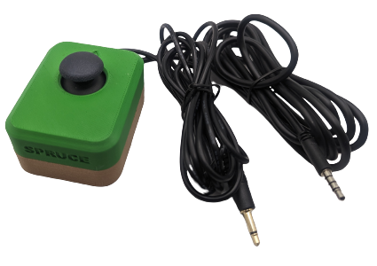

 # Spruce Mini Joystick

<!--- 
SUMMARY
A brief summary of the project. What it does, who it is for, how much it costs.
 --->
The Spruce Mini Joystick is a mini sized proportional joystick that can be used for adaptive gaming or computer access with a suitable adaptor. Based on a generic PS2-style game controller thumbstick, it has range of motion of ±30° and requires approximately 75 grams-force to fully deflect. This joystick has a two output cables, one with a 3.5 mm TRRS audio plug (i.e., headphone jack) for the joystick, and one with a 3.5 mm mono audio plug for the push switch. 

The Spruce Mini Joystick is directly compatible with the Xbox Adaptive Controller and the Playstation Access Controller. The Spruce Mini Joystick can be used directly as a left or right thumbstick for the [Microsoft Xbox Adaptive Controller (XAC)](https://www.xbox.com/en-CA/accessories/controllers/xbox-adaptive-controller) using the X1 or X2 analog input ports. 

The Spruce Mini Joystick can also be used with the [Forest Joystick Mouse Hub](https://github.com/makersmakingchange/Forest-Joystick-Mouse-Hub) as a USB Gamepad or USB Mouse for compatiblity with computers, tablets, and smartphones.

The Spruce Mini Joystick is open assistive technology (OpenAT). Under the terms of the open source licenses, the device may be built, used, and improved upon by anyone.

The current version of the Spruce Mini Joystick (v1.0) has been built and internally tested. It is based on a similar design that has been built and user tested.  

<!--- 
DEVICE PHOTO
 --->
 
 

## Makers Making Change Assistive Device Library
 
 - [Makers Making Change Device Page](https://www.makersmakingchange.com/s/product/spruce-mini-joystick/01tJR000000EHqbYAG)

<!--- 
Other available joysticks can be found through the [Joystick Selection Guide](https://makersmakingchange.com/resource/analog-joystick-selection-guide/)
 --->

## OpenAT Joysticks
This design is part of the [OpenAT Joystick project](https://github.com/makersmakingchange/OpenAT-Joysticks), a collection of open source designs for digital access and adapted gaming.  

## How to Obtain a Spruce Mini Joystick
There are several options for obtaining the device.

### 1. Do it Yourself (DIY) or Do it Together (DIT)

This is an open-source assistive technology, so anyone is free to build it. All of the files and instructions required to build the Spruce Mini Joystick are contained within this repository.

### 2. Request a build of this device

If you would like to obtain a Spruce Mini Joystick, you may submit a build request through the [MMC Library Page](https://www.makersmakingchange.com/s/product/spruce-mini-joystick/01tJR000000EHqbYAG). The requestor is responsible for the cost of materials and any shipping.

### 3. How to build this device for someone else
If you have the skills and equipment to build this device, and would like to donate your time to create the joystick for someone who needs it, visit the [MMC Maker Wanted](https://makersmakingchange.com/maker-wanted/) section.

## Getting Started

### 1. Read the Makers Checklist

The Makers Checklist in the [Maker Guide](/Documentation/Spruce_Joystick_Maker_Guide.pdf) contains a list of tasks to complete to build the device.

### 2. Order the Off-The-Shelf Components

The [Spruce Joystick Bill of Materials](/Documentation/Spruce_Joystick_BOM.csv) lists all of the parts and components required to build the Spruce Mini Joystick.

### 3. Print the 3D Printable components

Print the components needed for the Spruce Mini Joystick. Make sure to ask the user if they would like any of the optional prints such as toppers or mount adapters. Refer to the [OpenAT Joystick Setup Guide](https://github.com/makersmakingchange/OpenAT-Joysticks/Resources/OpenAT_Joystick_Setup_Guide.pdf) for detailed mounting options. For compatible toppers, see the [Analog Thumbstick Topper Collection by AbleGamers](https://www.printables.com/model/501869-analog-thumbstick-topper-collection).

All of the files and individual print files can be in the [/Build_Files/3D_Printing_Files](/Build_Files/3D_Printing_Files/) folder.

### 4. Assemble the Oak Compact Joystick

Reference the [Maker Guide](/Documentation/Spruce_Joystick_Maker_Guide.pdf) for the tools and steps required to build each portion.

## Files
### Documentation
| Document             | Version | Link |
|----------------------|---------|------|
| Design Rationale     | 1.0     | [Spruce_Mini_Joystick_Design_Rationale](/Documentation/Spruce_Joystick_Design_Rationale.pdf)     |
| Bill of Materials    | 1.0     | [Spruce_Mini_Joystick_Bill_of_Materials](/Documentation/Spruce_Joystick_BOM.csv)     |
| Maker Guide          | 1.0     | [Spruce_Mini_Joystick_Maker_Guide](/Documentation/Spruce_Joystick_Maker_Guide.pdf)     |
| User Guide           | 1.0     | [Spruce_Mini_Joystick_User_Guide](/Documentation/Spruce_Joystick_User_Guide.pdf)    |

### Design Files
<!---
DESIGN FILES
If possible, include a copy of original design files to facilitate easy editing and customization.
--->
 - [CAD Files](/Design_Files)

### Build Files
<!---
BUILD FILES
This section lists links to the various files used to build the device.
--->
 - [3D Printing Files](/Build_Files/3D_Print_files)

## Using a Spruce Mini Joystick

### Changing Toppers

https://www.youtube.com/watch?v=3ufB1Ncezi8

## License
Copyright (c) 2023 Neil Squire / Makers Making Change.

This repository describes Open Hardware:
 - Everything needed or used to design, make, test, or prepare the Spruce Mini Joystick is licensed under the [CERN 2.0 Weakly Reciprocal license (CERN-OHL-W v2) or later](https://cern.ch/cern-ohl ) .
 - Accompanying material such as instruction manuals, videos, and other copyrightable works that are useful but not necessary to design, make, test, or prepare the Spruce Mini Joystick are published under a [Creative Commons Attribution-ShareAlike 4.0 license (CC BY-SA 4.0)](https://creativecommons.org/licenses/by-sa/4.0/) .

You may redistribute and modify this documentation and make products using it under the terms of the [CERN-OHL-W v2](https://cern.ch/cern-ohl).
This documentation is distributed WITHOUT ANY EXPRESS OR IMPLIED WARRANTY, INCLUDING OF MERCHANTABILITY, SATISFACTORY QUALITY AND FITNESS FOR A PARTICULAR PURPOSE.
Please see the CERN-OHL-W v2 for applicable conditions.

Source Location: https://github.com/makersmakingchange/Spruce-Mini-Joystick

## Attribution
<!---
ATTRIBUTION
Include any information related to the development of the design. This may include who identified the initial challenge, who contributed to the design
--->

Enclosure design based on [snap assembly thumbstick shell](https://www.printables.com/model/508909-snap-assembly-thumbstick-shell/files) by [AbleGamers Charity](https://ablegamers.org/).

[Spruce Joystick Toppers](https://www.printables.com/model/501869-analog-thumbstick-topper-collection) designed by AbleGamers Charity is used under a CC BY-NC 4.0 license. 

The documentation template was created by Makers Making Change / Neil Squire and is used under a CC BY-SA 4.0 license. It is available at the following link: https://github.com/makersmakingchange/OpenAT-Template

### Contributors
 - Josie Versloot, Neil Squire Society. Hardware and enclosure design.

---

## About Makers Making Change

Makers Making Change is a program of [Neil Squire](https://www.neilsquire.ca/), a Canadian non-profit that uses technology, knowledge, and passion to empower people with disabilities.

Makers Making Change leverages the capacity of community based Makers, Disability Professionals and Volunteers to develop and deliver affordable Open Source Assistive Technologies.

 - Website: [www.MakersMakingChange.com](https://www.makersmakingchange.com/)
 - GitHub: [makersmakingchange](https://github.com/makersmakingchange)
 - X (formerly Twitter): [@makermakechange](https://twitter.com/makermakechange)
 - Instagram: [@makersmakingchange](https://www.instagram.com/makersmakingchange)
 - Facebook: [makersmakechange](https://www.facebook.com/makersmakechange)
 - LinkedIn: [Neil Squire Society](https://www.linkedin.com/company/neil-squire-society/)
 - Thingiverse: [makersmakingchange](https://www.thingiverse.com/makersmakingchange/about)
 - Printables: [MakersMakingChange](https://www.printables.com/@MakersMakingChange)

### Contact Us
For technical questions, to get involved, or to share your experience we encourage you to [visit our website](https://www.makersmakingchange.com/) or [contact us](https://www.makersmakingchange.com/s/contact).